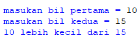
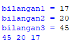
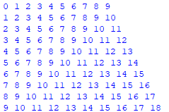

#### LAB 2

#### Latihan 1 Program Menentukan dua bilangan terbesar
Buat program sederhada dengan input 2 buah bilangan, kemudian tentukan bilangan terbesar dari kedua bilangan tersebut menggunakan statement if.
### 
### 

#### Latihan 2 Program Mengurutkan 3 Variable dari kecil ke terbesar
Buat program untuk mengurutkan data berdasarkan input sejumlah data (minimal 3 variable input atau lebih), kemudian tampilkan hasilnya secara berurutan mulai dari data terkecil.
### 
### 

#### LAB 3

#### Latihan 1 Bertingkat
Buat program dengan perulangan bertingkat (nested) for yang menghasilkan output sebagai berikut:
### 
### 

#### Latihan 2 Lebih kecil dari 0.5
`` Tampilkan n bilangan acak yang lebih kecil dari 0.5.
`` Nilai n diisi pada saat runtime
`` Anda bisa menggunakan kombinasi while dan for untuk menyelesaikannya
### 
### 
