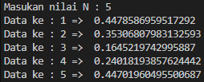

#### LAB 2

#### Latihan 1 Program Menentukan dua bilangan terbesar
### 

#### Latihan 2 Program Mengurutkan 3 Variable dari kecil ke terbesar
### 

#### LAB 3

#### Latihan 1 Bertingkat
### 

#### Latihan 2 Lebih kecil dari 0.5
### 
